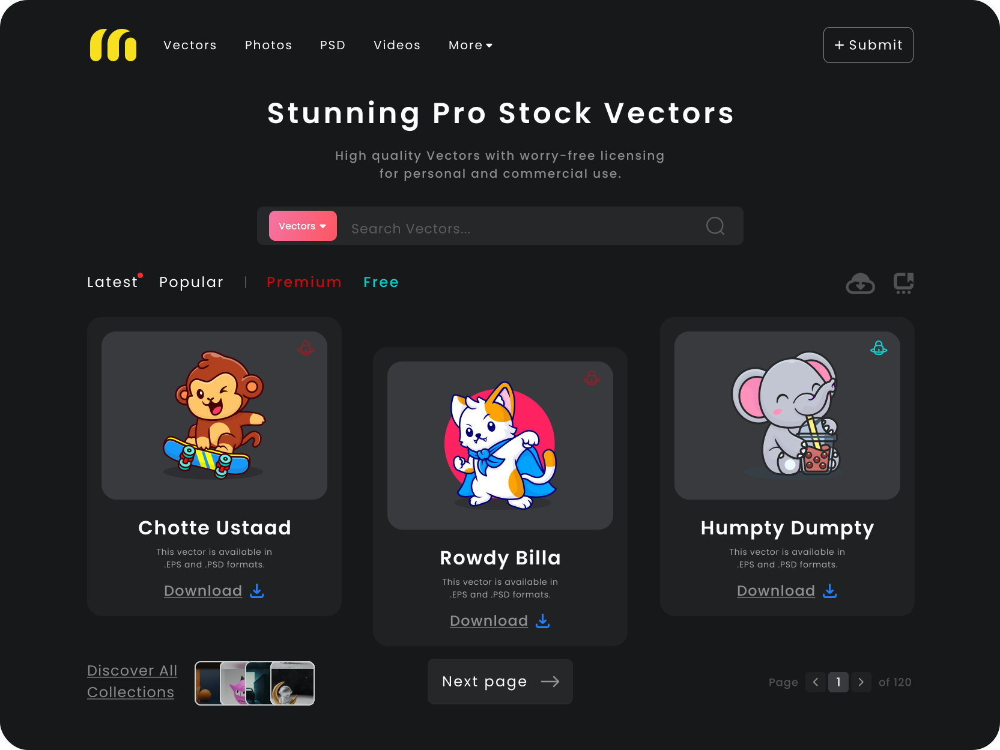

<p align="center">
      
</p>

<h1 align="center">Vectors Store Layout</h1>

<h2 align="center">About 📖</h2>
   
<p align="left">
  This is a study project, in order to improve my knowledge about the use of semantic HTML and CSS properties. In addition, there was the objective of using Sass as a CSS preprocessor, which helps to reduce CSS redundancies and ultimately saves time 😊
</p>
<br>

---

<h2 align="center">Preview 💻</h2>

   <p align="center">
      
   </p>

---

<h2 align="center">Layout 🎨</h2>

   <p align="center">
      The Layout was developed by <a href="https://www.figma.com/@vinaytekwani">Vinay Tekwani</a>, and you can access it on Figma:
      
   - <a href="https://www.figma.com/community/file/1111257172799939504">Desktop</a> 🖥️
   </p>

---

<h2 align="center">Technologies 🚀</h2>

- [Sass](https://sass-lang.com/)
- [HTML](https://developer.mozilla.org/en-US/docs/Web/HTML)
- [CSS](https://developer.mozilla.org/en-US/docs/Web/CSS)


---

<h2 align="center">How to Use 🤔</h2>

   ```
   - Clone this repository:
   $ git clone https://github.com/leclm/vectorStore.git

   - Enter in directory:
   $ cd vectorStore

   - For watch Sass modifications:
   $ sass --watch app/:style/

   - Open your browser in:
   http://localhost:5500/
   ```

---

<h2 align="center">How to Contribute 💪</h2>

   ```
   - Fork the project 

   - Create a new branch with your changes:
   $ git checkout -b my-feature

   - Save your changes and create a commit message telling you what you did:
   $ git commit -m "feature: My new feature"

   - Submit your changes:
   $ git push origin my-feature
   ```

---

<h2 align="center">License 📝</h2>

<p align="center">
   This repository is under MIT license. You can see the <a href="https://github.com/leclm/vectorStore/blob/main/LICENSE">LICENSE</a> file for more details. 😉
</p>

---

>This project was developed by **[@Letícia Lima](https://www.linkedin.com/in/leticiachagaslima/)**, as a way to improve my knowledge and pratice 💜

---

<div align="center">

[](https://www.linkedin.com/in/leticiachagaslima/)

</div>